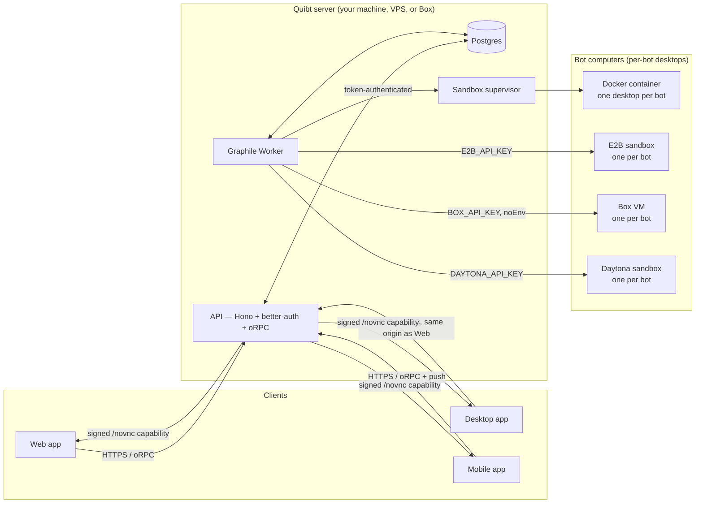

# Architecture

Quibt Bot has two independent questions, and this document (and every guide it links to)
answers them separately:

**Onde o Quibt fica ligado?** — where the **server** (API, worker, Postgres, the sandbox
supervisor) runs. **Onde os bots trabalham?** — where each **bot's own computer** (the Linux
desktop it clicks around in) runs. The two answers are picked independently and can differ:
a server on a VPS can still hand its bots Docker desktops on that same VPS, or E2B sandboxes,
Box VMs, or Daytona sandboxes.

This document is the long-form map for engineers. [`docs/mobile.md`](./mobile.md) covers the
phone client specifically; [`docs/self-host.md`](./self-host.md), [`docs/computers.md`](./computers.md),
and [`docs/onboarding.md`](./onboarding.md) are the plain-language guides for the same product.

## Clients

Web (Vite + React), Electron (desktop, wraps the same web bundle), and Expo (mobile, iOS +
Android) are three clients of **one** API. None of them run agent commands as the host's
macOS/Windows/Linux user — Electron's window is a browser shell, not a shell.

```
apps/web       Vite + React, the signed-in product
apps/desktop   Electron wrapper around the same web origin
apps/mobile    Expo Router, native SecureStore + push + WebView screen
apps/www       Astro marketing site (quibt.com.br) — separate origin, no auth
```

## Server stack

The signed-in product is a long-running process set, not a static site or a serverless
function:

- **API** (Hono) — auth (better-auth), oRPC endpoints, signed `/novnc/*` screen
  capabilities, the bootstrap/pairing endpoints mobile and the desktop wizard use.
- **Worker** (Graphile Worker) — runs bot turns, tool calls, and scheduled/idle jobs against
  the same Postgres `LISTEN`/`NOTIFY` queue the API enqueues into.
- **Postgres** — every workspace, bot, thread, message, memory, and `deployment_settings`
  row (including the saved machine choice).
- **Sandbox supervisor** — the process that actually owns Docker socket access and computer
  lifecycle for the `docker` / `remote-supervisor` family. E2B, Box, and Daytona calls go straight from
  the API/worker to their APIs; there is no local supervisor for them.

**Server hosts:** your own machine (source checkout or the `quibtbot install` CLI), a VPS you
provision yourself (the `remote-supervisor` bootstrap script), or a persistent Box VM
(`quibtbot install` run inside it).

E2B never hosts the Quibt server. Daytona never hosts it either. Both are bot-computer providers only, never places the
API/worker/Postgres run. This mirrors `apps/mobile/lib/server-setup.ts`, whose
`ServerHostKind` union is deliberately `"local" | "vps" | "box"` with no `"e2b"` member.

## Computer providers

Separate from the server, each bot needs a Linux desktop to click around in. Five families,
picked in onboarding or **Settings → Máquina**, saved in `deployment_settings`:

| Provider | Sharing model | Notes |
| --- | --- | --- |
| `docker` (default) | Shared computer, **one graphical desktop per bot** | One container per workspace; Xvfb + noVNC + Chromium per bot inside it. Home and some Chromium cookies are shared across bots in that workspace. |
| `remote-supervisor` | Same as `docker`, on a host you run | Same supervisor software, pointed at a VPS instead of `localhost`. The phone keeps working when your laptop is off. |
| `e2b` | **One sandbox per bot** | Bot computer only — never a Quibt server host (see above). Isolated: no shared files, no shared display, not a browser tab. |
| `box` | **One VM per bot** | `ttlSeconds: null` (no provider auto-stop; Quibt's own idle timer stops it), `noEnv: true` (operator secrets never enter the VM). Persistent disk survives a stop/resume cycle. |
| `daytona` | **One sandbox per bot** | Default graphical image; Computer Use starts VNC/noVNC, the panel gets a signed port-6080 preview, and stop/start preserves the sandbox filesystem. |
| `desktop` / `fake` | Disabled / in-process emulator | Tests only (`pnpm verify:fast`). Refused in production. |

The router (`createRoutingSandboxProvider`) never migrates a computer that already booted to a
different provider; a computer stays in the family that created it until it is deleted.

## Persistence

| Data | Where | Notes |
| --- | --- | --- |
| Workspaces, bots, threads, messages, memory, `deployment_settings` | Postgres | The only source of truth; every client reads it through the API. |
| Bot home directories | `DATA_DIR` on the sandbox host (or inside the E2B/Box/Daytona computer) | Local filesystem today; object-storage-backed homes are not wired yet. |
| Portable computer home (files + Chromium profile) | `DATA_DIR/workspace-checkpoints/<botId>/` | Encrypted with `ENCRYPTION_KEY`. Provider disk is a cache; Docker↔Box↔E2B↔Daytona restore this snapshot. GUI windows do not teleport. |
| Chat attachments (screenshots, PDFs, voice notes) | `ARTIFACTS_DIR` | Local filesystem, defaults to `./data/artifacts`. |
| Mobile session token, SSH/Box credentials, push token | Device SecureStore (Keychain / Keystore) | Never touches Postgres; see [`docs/mobile.md`](./mobile.md). |
| Encrypted secrets (model keys, provider tokens) | Postgres, encrypted with `ENCRYPTION_KEY` | Decrypted only inside the API/worker process. |

## Trust boundaries

- The Electron and mobile apps are **untrusted clients** of the API — same auth, same
  permission checks as the web app. Neither one is granted host OS access.
- The **sandbox supervisor** is the one process with Docker socket access. The API/worker
  never get an unrestricted socket; they call the supervisor over an internal, token-authenticated
  connection (`SANDBOX_SUPERVISOR_TOKEN`).
- Every bot computer (Docker container, E2B/Daytona sandbox, or Box VM) is untrusted relative to the
  host that owns it. Docker containers are resource-limited and, with
  `SANDBOX_SCREEN_NETWORK=internal`, isolated onto a dedicated Docker network away from
  Postgres and the application network.
- Box VMs are created with `noEnv: true`: the operator's Quibt secrets are never copied into
  them. E2B and Daytona sandboxes never see the API's encryption key either — they only receive the
  commands a bot's turn issues.
- The live screen (noVNC) is served through short-lived, signed `/novnc/<host>/<port>/<expiresAt>.<sig>`
  capabilities minted by the API. Nothing proxies an unrestricted port straight onto the
  internet.

## Network flow



The same API answers every client. Bot computers never talk to Postgres directly and never
receive the operator's encryption key; they only receive the shell/browser commands a bot's
turn issues and stream a screen back through the supervisor (Docker) or the provider's own
stream (E2B/Box/Daytona).

## Pairing

A phone (or a second browser) joins an existing install without ever seeing a password:

1. The owner opens **Settings → Celular** on an already-signed-in client. On a local PC the
   QR defaults to the LAN API. **Qualquer rede** uses the deployment's saved HTTPS origin
   (`webhookPublicUrl`) — a Cloudflare Tunnel or Tailscale Funnel the owner runs, pointed at
   `http://127.0.0.1:5173`. Quibt does not host that tunnel. A VPS or Box-hosted server already
   has a public origin, so the phone does not need one.
2. **Liberar entrada por 2 minutos** mints a one-time token tied to that session
   (`/api/auth/one-time-token`). The QR (`quibt://connect?api=…&pair=…`) carries the server URL
   and, after that tap, the token.
3. The phone scans it, probes `/rpc/health`, then exchanges the token at
   `/api/auth/one-time-token/verify`. The session lives in SecureStore — never in a cookie a
   web view could read.
4. The token expires in two minutes, works once, and dies if the pairing screen closes early.

The very first owner of a fresh install goes through the same shape in reverse: `quibtbot install`
(or the desktop wizard) prints a URL, a short human code, and the same deep link/QR, and the
phone's "Conectar a um Quibt existente" flow consumes it.

## Deployment modes

| Mode | Server host | Typical computer | Who it fits |
| --- | --- | --- | --- |
| Local | This machine (`pnpm dev` or `quibtbot install`) | `docker` | One person, one machine, no cloud account. |
| VPS | Your own Ubuntu VPS (`remote-supervisor` bootstrap script) | `docker` on the same VPS, or `e2b`/`box`/`daytona` | Always-on server without leaving a laptop open. |
| Box-hosted server | A persistent Box VM (`quibtbot install` run inside it) | Usually a different Box VM per bot | Always-on server without managing a VPS. |
| Public / multi-user | VPS or Box, `QUIBT_EDITION=cloud` for operators only | `e2b`, `box`, or `daytona` (never shared `docker`) | Anyone exposing the product to users they do not fully trust; `assertEditionMachine` refuses shared Docker in that mode. |

A multi-tenant billing engine remains inside the API for operators who run it themselves
(`docs/editions.md`), but the public install path — this document, the README, and every
onboarding screen — never offers a paid hosted tier or a signup queue. Self-hosting is the
only public product.
